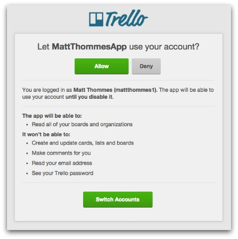
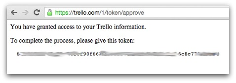
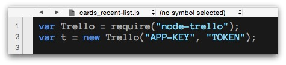
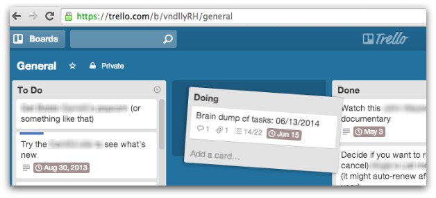
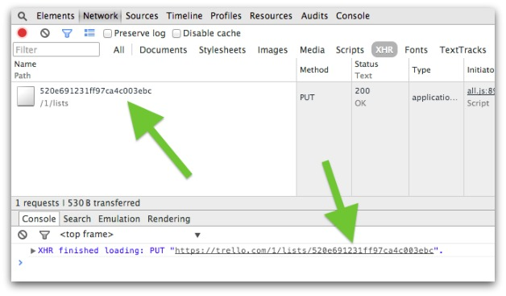

# Trello API scripts

Using the Trello API:

1. Cards in a list (Node.js)
2. [Export all card data from a board (PHP)](/export)

## `cards_recent-list.js`

I wanted a quick way to output all cards in a particular Trello list. The Trello interface is great, but once you have a lot of cards in a particular list, it's hard to visualize them all.

This script uses Node.js to fetch all cards from a certain Trello board & list. So once you have the list ID, you can use that to generate all cards in that list.

### Getting your auth keys

[Read the instructions here](https://github.com/adunkman/node-trello) on getting your key and token.

Fill in the values at the top of the script:

### Usage

There are various ways to get the list ID, but I found just inspecting things in Chrome to be the quickest. Just drag the list (that you want the ID for) back onto itself (slightly drag away then right back):

In the inspector you'll see a network request made that shows the raw list ID:

Set that list ID as the value of the `list_id` variable (near the top of the script).

Example output:

	'LIST NAME' cards:

	1. Label Name [Card Name here](https://trello.com/c/xxxxxx)

	2. Another Label Name [Card 2 Name here](https://trello.com/c/xxxxxx)

You can then copy/paste this output into a Markdown editor to view the HTML.