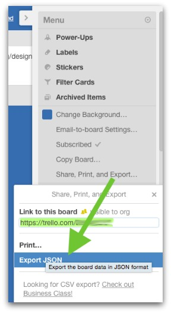

# Exporting Trello Data

This script will handle parsing your exported Trello data. Instead of using the API to grab this data, we'll just download the JSON file that is provided for each board:

Save this data as `export.json` in this directory, then hit the URL to the `/export/` directory.